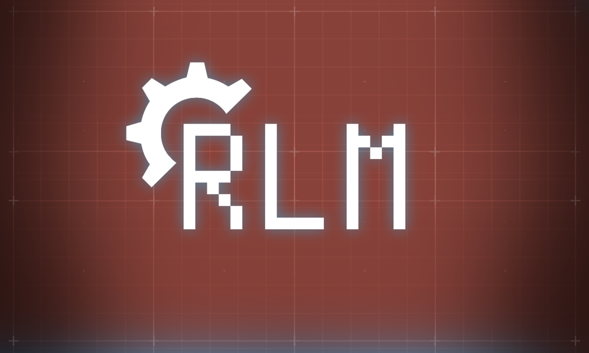

<p align="center"></p>

<h1 align="center">RLM — Roleplay Machine</h1>

<p align="center">
  Узловой клиент для ролеплея с ИИ: память, Хроника, Критик, кубик и <b>сетевая игра в Telegram</b>.<br>
  <a href="https://leosmaru.github.io/rlm/"><b>leosmaru.github.io/rlm</b></a> · основа — движок SillyTavern (AGPL-3.0)
</p>

---

## Что это

Карточка, промт, лорбуки, память и модель — отдельные ноды на холсте. Видно, что уходит модели и почему
пришёл именно такой ответ.

- **Душа** — модель сама ведёт дневник, состояние сцены, факты мира и психологию персонажей.
- **Хроника** — сцены сжимаются в главы, главы — в арки и эпосы.
- **Критик** — заворачивает подлиз, безволие, игру за игрока и читы.
- **Кубик** — исход брошен до сцены, модель не может его подменить.
- **Сетевая игра в Telegram** — ролеплей на несколько живых игроков: у каждого своя персона, память,
  состояние и свой бросок; ИИ ведёт партию.
- **Консоль запросов** — что ушло, сколько токенов, что вернулось; свой лимит контекста и температура
  у каждой подсистемы.
- **Каталог карточек** — chub.ai, Character Tavern, RisuRealm.

## Установка

### ПК · Windows

```
git clone https://github.com/Leosmaru/rlm
cd rlm/pc/server && npm install --omit=dev
```

Запуск — `Запустить RLM.bat`. Холст: `127.0.0.1:8100/rlm/`

### Телефон · Termux

```
pkg install -y git nodejs-lts
git clone --depth 1 https://github.com/Leosmaru/rlm
cd rlm/termux && ./install-termux.sh
```

Дальше запуск одной командой: `rlm`. Всё то же, кроме озвучки.

## Папки

| Папка | Что внутри |
|---|---|
| `pc/` | сборка для ПК (со всем, включая голос) |
| `termux/` | сборка для телефона (без голоса) |
| `docs/` | сайт проекта (GitHub Pages) |

Ключей и карточек в сборках нет — вписываешь свои.

## От автора

Это плод больной фантазии, которая заработала. Нормального гайда нет. Входной порог большой.
Однажды, возможно, я к нему вернусь.
